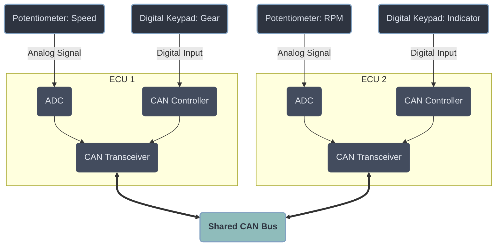

# PIC18 Automotive CAN Node Simulator

This project is an automotive network simulator built using PIC18 microcontrollers. It simulates a distributed vehicle system where sensor data (speed, RPM, gears, indicators) is read by transmitter nodes and shared over a Controller Area Network (CAN) bus to a central display node (ECU3).

## Table of Contents
- [Features](#features)
- [System Architecture](#system-architecture)
- [Hardware Required](#hardware-required)
- [Getting Started](#getting-started)

## Features
- **Multi-Node Network:** Independent PIC18 nodes communicating over a shared CAN bus.
- **Hardware CAN:** Uses the PIC18 microcontroller's internal CAN module paired with external CAN transceivers.
- **Sensor Acquisition:** Simulates driving metrics using analog inputs (potentiometers for speed/RPM) and digital inputs (switches for gears and turn indicators).

## System Architecture

The following diagram shows the hardware configuration and data flow for the sender nodes (ECU1 and ECU2) and the shared CAN bus:



## Hardware Required
- 3x Rhydolabz PIC18 Development Boards (with onboard CAN transceivers)
- 2x 10kΩ Potentiometers (for Speed and RPM simulation)
- 2x Digital Keypads/Switches (for Gear and Indicator selection)
- Twisted-pair wiring (for CAN_H / CAN_L connections)
- 120Ω termination resistors (or termination jumpers enabled on development boards)

## Getting Started

### 1. Clone the Repository
```bash
git clone https://github.com/k0-R0/Car_Dashboard.git
```

### 2. Environment Setup
- Open MPLAB X IDE.
- Ensure the XC8 compiler is installed and configured.

### 3. Flashing the ECUs
Open and flash the following projects to the respective boards:
- Open `ECU1.X`, compile, and flash to Board 1.
- Open `ECU2.X`, compile, and flash to Board 2.
- Open `ECU3.X`, compile, and flash to Board 3.

### 4. Wiring and Bus Termination
- Connect the CAN High (`CAN_H`) and CAN Low (`CAN_L`) terminals across all three boards using twisted-pair wiring.
- Ensure exactly two 120Ω termination resistors (or termination jumpers) are enabled at the physical ends of the CAN bus.
